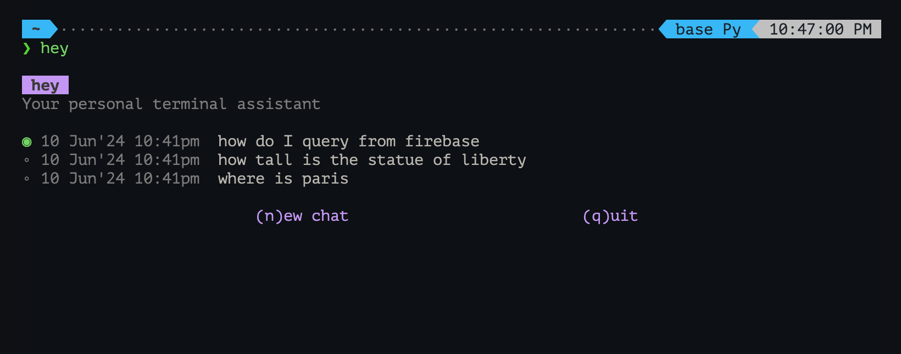
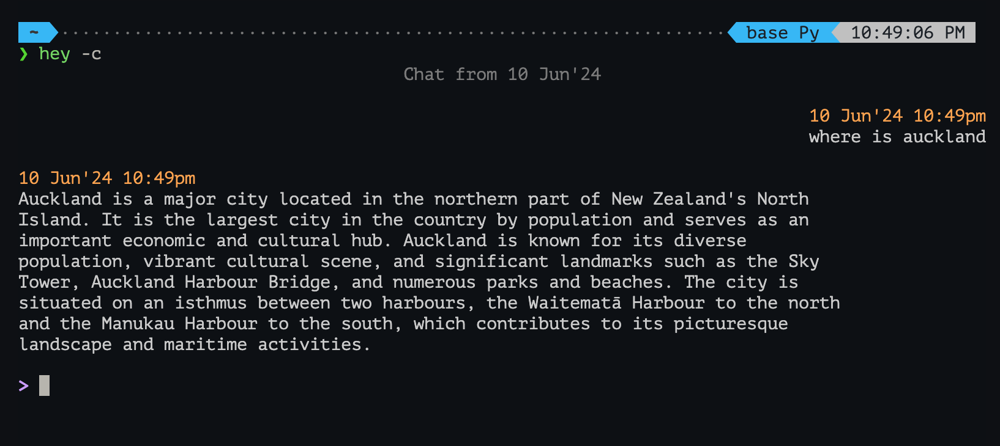

# hey
Your personal terminal assistant

                                                 

## Install

#### 1. Clone Repo
```bash
git clone https://github.com/HenrySeed/hey.git ~/hey
```

#### 2. Install Dependencies
```bash
pip3 install openai colorama
```

#### 3. Install Glow
Its used to make the markdown output from openai look a lot, lot nicer.

Follow the instruction [here](https://github.com/charmbracelet/glow)

#### 4. Add Alias
```bash
echo "alias hey='python3 ~/hey/main.py'" >> ~/.bashrc   # For Bash
# or
echo "alias hey='python3 ~/hey/main.py'" >> ~/.zshrc    # For ZSH
```

#### 5. Add your OpenAI API key
Replace `API_KEY_GOES_HERE` with your key (eg: sk-J2K8J23HB...)
```bash
echo "export OPENAI_API_KEY='API_KEY_GOES_HERE'" >> ~/.bashrc   # For Bash
# or
echo "export OPENAI_API_KEY='API_KEY_GOES_HERE'" >> ~/.zshrc    # For ZSH
```


## Usage

                                                 

```
hey 
Your personal terminal assistant

Usage: hey [OPTIONS] [PROMPT]
Options:
  -b, --browse     Choose a previous chat to continue from
  -c, --continue   Continue the previous chat
  --clear-history  Removes all previous chats
```

#### Examples
```
$ hey how you doing                                   

I'm an AI, so I don't have feelings, but thanks for asking! How can I assist you today?
```

```
$ hey                             

hey 
Your personal terminal assistant

◉ 10 Jun'24 10:41pm  how do I query from firebase                              
◦ 10 Jun'24 10:41pm  how tall is the statue of liberty                         
◦ 10 Jun'24 10:41pm  where is paris                                            

                         (n)ew chat                         (q)uit
```

```
$ hey -c

# continues from the most recent comnversation
```
